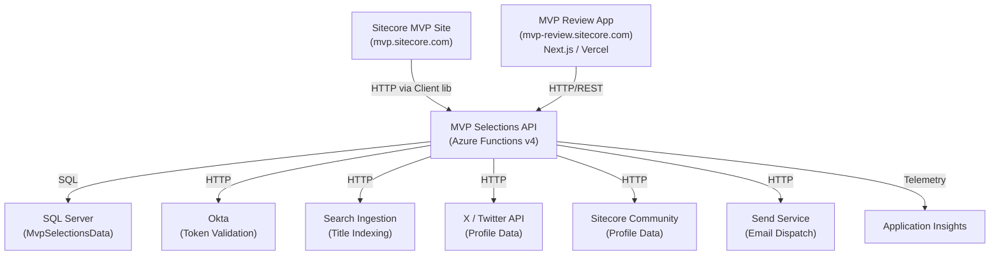
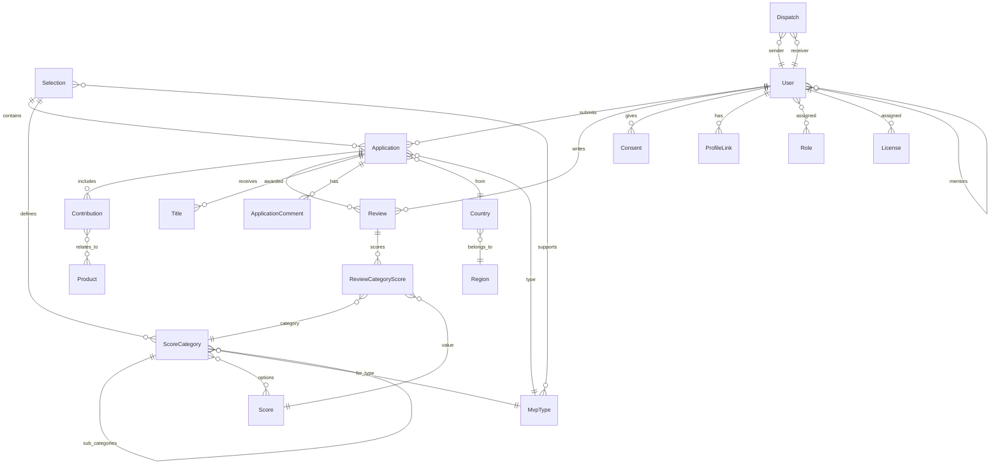

# Sitecore MVP Selections API

**Service:** mvp.selections.api  
**Product Owner:** @iva_sitecore  
**Architect:** @iva_sitecore  
**Last Updated:** 2026-03-12  
**Lifecycle:** Production  
**Type:** REST API (Azure Functions)  
**Repository:** [Sitecore/Mvp.Selections.Api](https://github.com/Sitecore/Mvp.Selections.Api)

---

## Table of Contents

- [Quick Reference (TL;DR)](#quick-reference-tldr)
- [Overview](#overview)
- [Architecture](#architecture)
- [Functional Requirements](#functional-requirements)
- [API Specification](#api-specification)
- [Data Model](#data-model)
- [Business Rules](#business-rules)
- [Authorization & Roles](#authorization--roles)
- [External Integrations](#external-integrations)
- [Client Library](#client-library)
- [Compliance & Audit](#compliance--audit)
- [Operations](#operations)
- [Non-Functional Requirements](#non-functional-requirements)
- [Known Issues & Limitations](#known-issues--limitations)
- [Additional Context](#additional-context)

---

## Quick Reference (TL;DR)

- **What:** REST API powering the Sitecore MVP selection and review process — manages applications, reviews, scoring, user profiles, and MVP awards
- **Owner:** @sc-ivanlieckens (CODEOWNERS)
- **Auth:** Okta JWT Bearer tokens; rights-based authorization (Admin, Apply, Review, Score, Comment, Award)
- **Base URL:** Azure Functions app (route prefix: `v1/`)
- **Key endpoints:**
  - `GET /v1/selections/current` — Current selection period
  - `POST /v1/selections/{id}/applications` — Submit an MVP application
  - `POST /v1/applications/{id}/reviews` — Submit a review for an application
  - `GET /v1/users/current` — Current authenticated user
  - `GET /v1/mvpprofiles/search` — Search MVP profiles
- **Database:** SQL Server via Entity Framework Core
- **Hosting:** Azure Functions v4 (Isolated Worker)
- **Consumers:** [Sitecore MVP Site](https://mvp.sitecore.com), [Sitecore MVP Review App](https://mvp-review.sitecore.com/)
- **Data sensitivity:** Contains PII (names, emails, country)

---

## Overview

The **Sitecore MVP Selections API** powers the end-to-end Sitecore Most Valuable Professional (MVP) selection process. It is the backend for both the public-facing [Sitecore MVP Site](https://mvp.sitecore.com) and the internal [MVP Review App](https://mvp-review.sitecore.com/).

### What Problem Does It Solve?

Sitecore recognizes outstanding community members as MVPs annually. This process involves:
1. **Applications** — community members apply for MVP status during an open selection period
2. **Reviews** — reviewers evaluate applications against scoring criteria
3. **Scoring** — applications are scored across weighted categories per MVP type
4. **Awards** — successful applicants are awarded MVP titles
5. **Profiles** — MVPs have searchable public profiles

The API manages the entire lifecycle: user registration, application submission, contribution tracking, peer review, scoring, title awards, license management, and public profile search.

### Who Uses It?

| Consumer | How |
|----------|-----|
| [Sitecore MVP Site](https://mvp.sitecore.com) | Via the .NET client library (`Mvp.Selections.Client` NuGet package) |
| [MVP Review App](https://mvp-review.sitecore.com/) | Direct HTTP/REST calls (Next.js on Vercel) |
| Search Ingestion service | API pushes title data for indexing |
| Sitecore Community platform | API fetches profile data from Community |

### Key Behaviors

- Manages annual **Selection** periods with configurable application and review windows
- Enforces a one-application-per-user-per-selection constraint
- Supports multiple **MVP types** (e.g., Technology MVP, Strategy MVP) with independent scoring criteria
- Implements a hierarchical scoring system with weighted categories and sub-categories
- Auto-provisions new users on first authentication, assigning the default "Candidate" role
- Provides mentor matching and contact functionality
- Manages MVP licenses (upload, assignment, download)
- Integrates with external systems: Okta (auth), Search Ingestion (indexing), X/Twitter (profile data), Sitecore Community (profile data), Send (email dispatch)

## Architecture

### Solution Structure

```
Mvp.Selections.sln
├── src/
│   ├── Mvp.Selections.Api          # Azure Functions API layer (endpoints, services, auth, serialization)
│   ├── Mvp.Selections.Domain       # Core domain models and enums (no dependencies)
│   ├── Mvp.Selections.Data         # EF Core DbContext, repositories, migrations
│   └── Mvp.Selections.Client       # .NET client library (NuGet package for consumers)
└── tests/
    ├── Mvp.Selections.Api.Tests    # API service unit tests
    ├── Mvp.Selections.Client.Tests # Client library tests
    └── Mvp.Selections.Tests        # Additional tests
```

**Dependency direction:** Api → Data → Domain ← Client

### System Context Diagram



### System Interactions

| Direction | System | Protocol | Purpose |
|-----------|--------|----------|---------|
| Inbound | Sitecore MVP Site | HTTP/REST | Primary consumer for public MVP site (via .NET client library) |
| Inbound | MVP Review App | HTTP/REST | Internal review and scoring interface (Next.js on Vercel, direct API calls) |
| Outbound | SQL Server | SQL (EF Core) | Primary data store |
| Outbound | Okta | HTTP | JWT token introspection/validation |
| Outbound | Search Ingestion | HTTP | Push MVP title data for search indexing |
| Outbound | X (Twitter) API | HTTP | Fetch user profile/avatar data |
| Outbound | Sitecore Community | HTTP | Fetch community profile data |
| Outbound | Send Service | HTTP | Transactional email dispatch (e.g., mentor contact) |
| Outbound | Application Insights | SDK | Telemetry, logging, monitoring |

### Data Stores

| Store | Type | Purpose | Retention |
|-------|------|---------|-----------|
| SQL Server (MvpSelectionsData) | Relational DB | All application, user, selection, review, and scoring data | Indefinite |

### Key Architectural Patterns

- **Azure Functions Isolated Worker** — Each API endpoint is an Azure Function triggered by HTTP; hosted in the isolated (out-of-process) model
- **Layered Architecture** — API → Service → Repository → DbContext, with clear separation of concerns
- **Repository Pattern** — Generic `BaseRepository<TEntity, TId>` provides CRUD; entity-specific repositories add custom queries
- **Service Layer** — Business logic encapsulated in service classes (e.g., `ApplicationService`, `UserService`, `ReviewService`); services coordinate between repositories and enforce business rules
- **Dependency Injection** — All services, repositories, helpers, and options registered via constructor injection
- **Interface-based Design** — All services and repositories accessed via interfaces
- **Strongly-typed Options** — Configuration bound to option classes (e.g., `OktaClientOptions`, `TokenOptions`, `MvpSelectionsOptions`)
- **Custom Serialization** — Newtonsoft.Json with type-safe `SerializationBinder` (whitelists domain assembly types only) and per-endpoint `ContractResolver`s to control property visibility
- **Asynchronous Programming** — All service and repository methods are async

## Functional Requirements

### FR-1: Selection Management

Administrators can create and manage annual selection periods. Each selection defines:
- A **year** (unique constraint)
- An **application window** (`ApplicationsStart` / `ApplicationsEnd`) with optional manual override (`ApplicationsActive`)
- A **review window** (`ReviewsStart` / `ReviewsEnd`) with optional manual override (`ReviewsActive`)
- Associated **MVP types** eligible for that selection
- A **finalized** flag indicating the selection process is complete

A selection's application and review windows can be determined either by the date range or explicitly overridden with the boolean active flags.

### FR-2: Application Lifecycle

1. An authenticated user with the `Apply` right can submit an application for a selection period
2. Each user may submit **only one application per selection** (enforced by unique index on `ApplicantId + SelectionId`)
3. An application captures: eligibility statement, objectives, mentor information, country, MVP type
4. Applications have a status: `Open` → `Submitted`
5. Applicants can add/update/remove **contributions** to their application
6. Applications can only be submitted while the selection's application window is open
7. Admins can view, update, and delete any application

### FR-3: Contribution Tracking

Each application includes contributions demonstrating the applicant's community involvement:
- Name, description, URI, date
- Type: BlogPost, Speaking, Code, Video, SocialMedia, BugReport, Feedback, Reference, Community, Mentor, Other
- Public/private visibility toggle
- Related products (many-to-many with Product)

### FR-4: Review Process

1. Users with the `Review` right can create reviews for applications
2. A review includes: a comment, status (`Open` / `Finished`), sentiment (`No` / `Maybe` / `Yes`)
3. Reviews contain **category scores** — each review scores the application across the selection's score categories
4. Each `ReviewCategoryScore` links a review to a score category and a specific score option
5. Admins can view, update, and delete reviews

### FR-5: Scoring System

The scoring system is hierarchical and per-MVP-type:
- **Score Categories** belong to a selection + MVP type combination
- Categories have: name, weight (decimal), sort rank, optional parent category
- Categories can have **sub-categories** (tree structure)
- Each category has **score options** (many-to-many with Score entity)
- Each category may have a **calculation score** for percentage calculations
- **Scores** have a name, value (integer), and sort rank
- The `CalculateScoreValue()` method on ScoreCategory determines the value used for percentage calculations

### FR-6: Title Awards

After the review process, users with the `Admin` or `Award` right can assign titles:
- Each title links an application to an MVP type (which may differ from the application's MVP type)
- Titles may include a warning message
- Titles can be indexed to the search ingestion service for public search

### FR-7: User Management

- Users are auto-provisioned on first authentication (assigned the default "Candidate" role)
- Admins can view, search (by name/email/country), add, and update users
- Admins can **merge users** (transfer data from old user to new user)
- Users can update their own profile via `/v1/users/current`
- Users have: identifier (from Okta), name, email, image type/URI, country, profile links, mentors

### FR-8: MVP Profile & Search

- Anyone (including anonymous/unauthenticated users) can view MVP profiles and search them
- Profiles aggregate user data with title information
- Search supports filtering by: text, MVP type IDs, years, country IDs, mentor status, open-to-mentees
- Admin users see additional profile details (unfiltered) vs non-admin/anonymous users (filtered)

### FR-9: Mentor System

- **Mentor registration:** Only MVPs can set mentor properties on themselves. A user who wishes to be a mentor creates/updates their own mentor entry (description, open-to-new-mentees flag). Admins can also manage mentor entries on behalf of users.
- **Mentor discovery:** Users with `Apply` or `Admin` right can list and view mentors, with filtering by name, email, and country.
- **Mentor contact:** Any authenticated user with `Apply` or `Admin` right can send a message to a mentor (triggers email dispatch via Send service).
- **Spam protection:** The system enforces rate limits on mentor contact to prevent spam:
  - A user can contact mentors a maximum of `MaxContactPer24HourPerUser` times in a rolling 24-hour window (default: **5**)
  - A user can only contact the **same mentor once** per 24-hour period
  - Exceeding either limit returns HTTP 429 (Too Many Requests)
- **Mentor removal:** A user (or admin) can remove their own mentor status, which clears the mentor flag, description, and open-to-mentees setting

### FR-10: Consent Management

- Users must give consent (Communications, PersonalInformation) to use the system
- Consent can be given and viewed per-user or for the current user
- Consent records track when granted and optionally when rejected

### FR-11: License Management

- Admins can upload licenses (via ZIP file), update license details, and list/get licenses
- Each license has content, an expiration date, and may be assigned to a user
- When an MVP attempts to download their current license and none is assigned yet, a license is automatically assigned if one is available
- Authenticated users can download their current license

### FR-12: Comments

- Users with the `Admin` or `Comment` right can view application comments
- Only admins can add comments to applications
- Admins can update and delete any comment; comment authors can also update and delete their own comments
- Comments are associated with applications (`ApplicationComment`)

### FR-13: Reference Data Management

Admins manage:
- **Products** — Sitecore products that contributions can relate to
- **MVP Types** — Categories of MVP awards (viewable by Apply/Review users)
- **Regions** — Geographic regions containing countries
- **Countries** — Seeded with ~250 countries at database creation, assigned to regions by admins

## API Specification

All endpoints are Azure Functions with HTTP triggers. Route prefix: `v1/`. Authentication is via `Authorization: Bearer <jwt>` header (Okta). The `Right` column shows which rights grant access (user needs **any one** of the listed rights).

### Request Handling Pattern

Every endpoint follows a consistent pipeline:
1. Azure Function trigger receives the HTTP request
2. `ExecuteSafeSecurityValidatedAsync` wraps the operation:
   - Validates the JWT token via Okta introspection
   - Resolves the user (or auto-provisions if new)
   - Checks the user has the required right(s)
   - On success, delegates to the service layer
   - On failure, returns appropriate HTTP status
3. Results are serialized via Newtonsoft.Json with endpoint-specific `ContractResolver`s
4. Exceptions are caught, logged, and returned as 500 responses

### Selections

| Method | Route | Right | Description |
|--------|-------|-------|-------------|
| GET | `/v1/selections/current` | Any | Get the current active selection |
| GET | `/v1/selections/{id}` | Admin | Get a specific selection |
| GET | `/v1/selections` | Admin | List all selections |
| POST | `/v1/selections` | Admin | Create a new selection |
| PATCH | `/v1/selections/{id}` | Admin | Update a selection |
| DELETE | `/v1/selections/{id}` | Admin | Delete a selection |

### Applications

| Method | Route | Right | Description |
|--------|-------|-------|-------------|
| GET | `/v1/applications/{id}` | Admin, Apply, Review | Get a specific application |
| GET | `/v1/applications` | Admin, Apply, Review | List all applications |
| GET | `/v1/selections/{selectionId}/applications` | Admin, Apply, Review | List applications for a selection |
| GET | `/v1/selections/{selectionId}/countries/{countryId}/applications` | Admin, Review | List applications for a country within a selection |
| GET | `/v1/users/{userId}/applications` | Admin, Apply, Review | List applications for a user |
| POST | `/v1/selections/{selectionId}/applications` | Admin, Apply | Submit a new application |
| PATCH | `/v1/applications/{id}` | Admin, Apply | Update an application |
| DELETE | `/v1/applications/{id}` | Admin | Delete an application |

### Applicants

| Method | Route | Right | Description |
|--------|-------|-------|-------------|
| GET | `/v1/selections/{selectionId}/applicants` | Admin, Review | List applicants for a selection |
| GET | `/v1/selections/{selectionId}/mvptypes/{mvpTypeId}/applicants/scorecards` | Admin, Score | Get applicant score cards |

### Contributions

| Method | Route | Right | Description |
|--------|-------|-------|-------------|
| GET | `/v1/contributions/{id}` | Any | Get a specific contribution |
| GET | `/v1/users/{userId}/contributions` | Any | List contributions for a user |
| POST | `/v1/applications/{applicationId}/contributions` | Admin, Apply | Add a contribution to an application |
| PATCH | `/v1/contributions/{id}` | Admin, Apply | Update a contribution |
| DELETE | `/v1/applications/{applicationId}/contributions/{id}` | Admin, Apply | Remove a contribution from an application |
| POST | `/v1/contributions/{id}/togglePublic` | Admin, Apply | Toggle contribution public visibility |

### Reviews

| Method | Route | Right | Description |
|--------|-------|-------|-------------|
| GET | `/v1/reviews/{id}` | Admin, Review | Get a specific review |
| GET | `/v1/applications/{applicationId}/reviews` | Admin, Review | List reviews for an application |
| POST | `/v1/applications/{applicationId}/reviews` | Admin, Review | Submit a new review |
| PATCH | `/v1/reviews/{id}` | Admin, Review | Update a review |
| DELETE | `/v1/reviews/{id}` | Admin | Delete a review |

### Users

| Method | Route | Right | Description |
|--------|-------|-------|-------------|
| GET | `/v1/users/current` | Any | Get the current authenticated user |
| PATCH | `/v1/users/current` | Any | Update the current user's profile |
| GET | `/v1/users/{id}` | Admin | Get a specific user |
| GET | `/v1/users` | Admin | List all users (filterable by name, email, countryId) |
| POST | `/v1/users` | Admin | Create a new user |
| PATCH | `/v1/users/{id}` | Admin | Update a user |
| GET | `/v1/applications/{applicationId}/reviewUsers` | Admin | Get users eligible to review an application |
| POST | `/v1/users/{oldId}/merge/{newId}` | Admin | Merge two user accounts |

### MVP Profiles

| Method | Route | Right | Description |
|--------|-------|-------|-------------|
| GET | `/v1/mvpprofiles/{id}` | Any (+ anonymous fallback) | Get an MVP profile (admin sees unfiltered data) |
| GET | `/v1/mvpprofiles/search` | Any (+ anonymous fallback) | Search MVP profiles (admin sees unfiltered data) |

### Mentors

| Method | Route | Right | Description |
|--------|-------|-------|-------------|
| GET | `/v1/mentors` | Apply, Admin | List all mentors |
| GET | `/v1/mentors/{id}` | Apply, Admin | Get a specific mentor |
| PATCH | `/v1/mentors/{id}` | Apply, Admin | Update a mentor |
| POST | `/v1/mentors` | Apply, Admin | Register as a mentor |
| DELETE | `/v1/mentors/{id}` | Apply, Admin | Remove a mentor |
| POST | `/v1/mentors/{id}/contact` | Apply, Admin | Contact a mentor (sends email via Send service) |

### Consents

| Method | Route | Right | Description |
|--------|-------|-------|-------------|
| GET | `/v1/users/{userId}/consents` | Admin | List consents for a user |
| GET | `/v1/users/current/consents` | Any | List consents for the current user |
| POST | `/v1/users/{userId}/consents` | Admin | Give consent on behalf of a user |
| POST | `/v1/users/current/consents` | Any | Give consent for the current user |

### Profile Links

| Method | Route | Right | Description |
|--------|-------|-------|-------------|
| POST | `/v1/users/{userId}/profilelinks` | Any | Add a profile link for a user |
| DELETE | `/v1/users/{userId}/profilelinks/{id}` | Any | Remove a profile link |

### Comments

| Method | Route | Right | Description |
|--------|-------|-------|-------------|
| GET | `/v1/applications/{applicationId}/comments` | Admin, Comment | List comments for an application |
| POST | `/v1/applications/{applicationId}/comments` | Admin | Add a comment to an application |
| PATCH | `/v1/comments/{id}` | Admin | Update a comment |
| DELETE | `/v1/comments/{id}` | Admin | Delete a comment |

### Titles

| Method | Route | Right | Description |
|--------|-------|-------|-------------|
| GET | `/v1/titles/{id}` | Any | Get a specific title (admin sees extra data) |
| GET | `/v1/titles` | Any | List all titles |
| POST | `/v1/applications/{applicationId}/titles` | Admin, Award | Award a title to an application |
| PATCH | `/v1/titles/{id}` | Admin, Award | Update a title |
| DELETE | `/v1/titles/{id}` | Admin | Delete a title |

### Licenses

| Method | Route | Right | Description |
|--------|-------|-------|-------------|
| POST | `/v1/licenses/upload` | Admin | Upload licenses (ZIP file) |
| PATCH | `/v1/licenses/{id}` | Admin | Update a license |
| GET | `/v1/licenses` | Admin | List all licenses |
| GET | `/v1/licenses/{id}` | Admin | Get a specific license |
| GET | `/v1/users/current/licenses/current/download` | Any | Download the current user's license |

### Scores

| Method | Route | Right | Description |
|--------|-------|-------|-------------|
| GET | `/v1/scores/{id}` | Admin, Score | Get a specific score |
| GET | `/v1/scores` | Admin, Score | List all scores |
| POST | `/v1/scores` | Admin, Score | Create a score |
| PATCH | `/v1/scores/{id}` | Admin, Score | Update a score |
| DELETE | `/v1/scores/{id}` | Admin, Score | Delete a score |

### Score Categories

| Method | Route | Right | Description |
|--------|-------|-------|-------------|
| GET | `/v1/selections/{selectionId}/mvptypes/{mvpTypeId}/scorecategories` | Admin, Review, Score | List score categories (admin sees extra data) |
| POST | `/v1/selections/{selectionId}/mvptypes/{mvpTypeId}/scorecategories` | Admin, Score | Create a score category |
| PATCH | `/v1/scorecategories/{id}` | Admin, Score | Update a score category |
| DELETE | `/v1/scorecategories/{id}` | Admin, Score | Delete a score category |

### Reference Data

| Method | Route | Right | Description |
|--------|-------|-------|-------------|
| GET | `/v1/countries` | Any | List all countries |
| GET | `/v1/products/{id}` | Any | Get a specific product |
| GET | `/v1/products` | Any | List all products |
| POST | `/v1/products` | Admin | Create a product |
| PATCH | `/v1/products/{id}` | Admin | Update a product |
| DELETE | `/v1/products/{id}` | Admin | Delete a product |
| GET | `/v1/mvptypes` | Admin, Apply, Review | List all MVP types |
| GET | `/v1/mvptypes/{id}` | Admin, Apply, Review | Get a specific MVP type |
| POST | `/v1/mvptypes` | Admin | Create an MVP type |
| PATCH | `/v1/mvptypes/{id}` | Admin | Update an MVP type |
| DELETE | `/v1/mvptypes/{id}` | Admin | Delete an MVP type |
| GET | `/v1/regions/{id}` | Admin | Get a specific region |
| GET | `/v1/regions` | Admin | List all regions |
| POST | `/v1/regions` | Admin | Create a region |
| PATCH | `/v1/regions/{id}` | Admin | Update a region |
| POST | `/v1/regions/{id}/countries` | Admin | Assign a country to a region |
| DELETE | `/v1/regions/{id}/countries/{countryId}` | Admin | Remove a country from a region |
| DELETE | `/v1/regions/{id}` | Admin | Delete a region |

### Roles

| Method | Route | Right | Description |
|--------|-------|-------|-------------|
| GET | `/v1/roles/system` | Admin | List all system roles |
| GET | `/v1/roles/system/{id}` | Admin | Get a specific system role |
| POST | `/v1/roles/system` | Admin | Create a system role |
| GET | `/v1/roles/selection` | Admin | List all selection roles |
| GET | `/v1/roles/selection/{id}` | Admin | Get a specific selection role |
| POST | `/v1/roles/selection` | Admin | Create a selection role |
| POST | `/v1/roles/{id}/users` | Admin | Assign a user to a role |
| DELETE | `/v1/roles/{id}/users/{userId}` | Admin | Remove a user from a role |
| DELETE | `/v1/roles/{id}` | Admin | Delete a role |

### System Endpoints

| Method | Route | Auth Level | Description |
|--------|-------|------------|-------------|
| GET | `/status` | Anonymous (no auth) | Health check — validates Okta config and DB connectivity |
| GET | `/init` | Admin (function key) | Run EF Core migrations |
| POST | `/index/titles` | Admin (function key) | Trigger title indexing to search ingestion |
| DELETE | `/index/titles` | Admin (function key) | Clear title index |

> **Note:** Endpoints with `AuthorizationLevel.Admin` require an Azure Functions host key, not JWT auth. These are system/operational endpoints.

## Data Model

### Database: SQL Server (via Entity Framework Core 9)

Connection string key: `ConnectionStrings:MvpSelectionsData`  
EF Core features: retry on failure, single query splitting behavior, context pooling

### Entity Relationship Diagram



### Core Entities

All entities inherit from `BaseEntity<TId>` which provides:
- `Id` (TId) — Primary key (auto-set)
- `CreatedOn` (DateTime) — UTC timestamp, set automatically
- `CreatedBy` (string) — Set to authenticated user's identifier
- `ModifiedOn` (DateTime?) — Updated on modification
- `ModifiedBy` (string?) — Updated on modification

#### User

| Field | Type | Constraints | Description |
|-------|------|-------------|-------------|
| Id | Guid | PK | |
| Identifier | string | Unique index | Okta user identifier (e.g., `00uqyu5bxcffmH3xP0h7`) |
| Name | string | Required | Display name |
| Email | string | Required | Email address |
| ImageType | ImageType enum | | `Anonymous`, `Community`, `Gravatar`, `Twitter` |
| ImageUri | Uri? | | Custom image URL |
| CountryId | short? | FK → Country | |
| IsMentor | bool | Internal | Whether user is a mentor |
| IsOpenToNewMentees | bool | Internal | Accepting new mentees |
| MentorDescription | string? | Internal | Mentor bio |

**Navigation:** Country, Mentors (self-referencing many-to-many), Applications, Consents, Links (ProfileLink), Reviews, Roles

**Computed:** `Rights` — Aggregated from SystemRole rights using bitwise OR. `RecalculateRights()` recomputes from roles. `HasRight(Right)` checks a specific right.

#### Selection

| Field | Type | Constraints | Description |
|-------|------|-------------|-------------|
| Id | Guid | PK | |
| Year | short | Unique (alternate key) | Selection year |
| ApplicationsActive | bool? | | Manual override for application window |
| ApplicationsStart | DateTime | Required | Application window opens |
| ApplicationsEnd | DateTime | Required | Application window closes |
| ReviewsActive | bool? | | Manual override for review window |
| ReviewsStart | DateTime | Required | Review window opens |
| ReviewsEnd | DateTime | Required | Review window closes |
| Finalized | bool | | Whether selection process is complete |

**Navigation:** MvpTypes (many-to-many)

**Methods:**
- `AreApplicationsOpen()` — Returns `ApplicationsActive ?? (ApplicationsStart < UtcNow && ApplicationsEnd > UtcNow)`
- `AreReviewsOpen()` — Returns `ReviewsActive ?? (ReviewsStart < UtcNow && ReviewsEnd > UtcNow)`

#### Application

| Field | Type | Constraints | Description |
|-------|------|-------------|-------------|
| Id | Guid | PK | |
| Eligibility | string? | | Eligibility statement |
| Objectives | string? | | Applicant's objectives |
| Mentor | string? | | Mentor information |
| ApplicantId | Guid | FK → User, Unique(ApplicantId+SelectionId) | |
| CountryId | short | FK → Country, Cascade delete | |
| MvpTypeId | short | FK → MvpType, Cascade delete | |
| SelectionId | Guid | FK → Selection, Cascade delete | |
| Status | ApplicationStatus | | `Open` (0) or `Submitted` (1) |

**Navigation:** Applicant (User), Country, MvpType, Selection, Titles, Contributions, Reviews

#### Contribution

| Field | Type | Constraints | Description |
|-------|------|-------------|-------------|
| Id | Guid | PK | |
| Name | string | Required | Contribution title |
| Description | string | Required | Details |
| Uri | Uri? | | Link to contribution |
| Date | DateTime | Required | When the contribution was made |
| IsPublic | bool | | Public visibility |
| Type | ContributionType | | See enum below |
| ApplicationId | Guid | FK → Application | |

**Navigation:** Application, RelatedProducts (many-to-many with Product, auto-included)

**ContributionType enum:** `Other` (0), `BlogPost` (1), `Speaking` (2), `Code` (3), `Video` (4), `SocialMedia` (5), `BugReport` (6), `Feedback` (7), `Reference` (8), `Community` (9), `Mentor` (10)

#### Review

| Field | Type | Constraints | Description |
|-------|------|-------------|-------------|
| Id | Guid | PK | |
| Comment | string | Required | Reviewer's written assessment |
| Status | ReviewStatus | | `Open` (0) or `Finished` (1) |
| ApplicationId | Guid | FK → Application | |
| ReviewerId | Guid | FK → User (no cascade) | |
| Sentiment | ReviewSentiment? | | `No` (0), `Maybe` (1), `Yes` (2) |

**Navigation:** Application, Reviewer (User), CategoryScores

#### ReviewCategoryScore

Composite entity linking a review's score for a specific category.

| Field | Type | Constraints | Description |
|-------|------|-------------|-------------|
| ReviewId | Guid | PK (composite), FK → Review (no cascade) | |
| ScoreCategoryId | Guid | PK (composite), FK → ScoreCategory | |
| ScoreId | Guid | PK (composite), FK → Score | |

#### ScoreCategory

| Field | Type | Constraints | Description |
|-------|------|-------------|-------------|
| Id | Guid | PK | |
| Name | string | Required | Category name |
| Weight | decimal | Precision(18,2), default 1 | Weight in scoring calculation |
| SortRank | int | Default 100 | Display order |
| MvpTypeId | short | FK → MvpType | |
| SelectionId | Guid | FK → Selection | |
| ParentCategoryId | Guid? | FK → ScoreCategory (self) | For sub-categories |
| CalculationScoreId | Guid? | FK → Score | Score used for percentage calculation |

**Navigation:** MvpType, Selection, ParentCategory, CalculationScore, ScoreOptions (many-to-many with Score), SubCategories

#### Score

| Field | Type | Constraints | Description |
|-------|------|-------------|-------------|
| Id | Guid | PK | |
| Name | string | Required | Score label |
| Value | int | Required | Numeric score value |
| SortRank | int | Default 100 | Display order |

**Navigation:** ScoreCategories (many-to-many)

#### Title

| Field | Type | Constraints | Description |
|-------|------|-------------|-------------|
| Id | Guid | PK | |
| Warning | string? | | Warning message |
| MvpTypeId | short | FK → MvpType (no cascade) | Awarded MVP type |
| ApplicationId | Guid | FK → Application | |

#### License

| Field | Type | Constraints | Description |
|-------|------|-------------|-------------|
| Id | Guid | PK | |
| LicenseContent | string | Required | License content/key |
| ExpirationDate | DateTime | Required | When the license expires |
| AssignedUserId | Guid? | FK → User | |

#### Consent

| Field | Type | Constraints | Description |
|-------|------|-------------|-------------|
| Id | Guid | PK | |
| RejectedOn | DateTime? | | When consent was withdrawn |
| UserId | Guid | FK → User, Cascade delete | |
| Type | ConsentType | | `Communications` (0), `PersonalInformation` (1) |

#### ProfileLink

| Field | Type | Constraints | Description |
|-------|------|-------------|-------------|
| Id | Guid | PK | |
| Name | string | Required | Display name |
| Uri | Uri | Required | Link URL |
| ImageUri | Uri? | | Link image/icon |
| Type | ProfileLinkType | | See enum below |
| UserId | Guid | FK → User | |

**ProfileLinkType enum:** `Other` (0), `Blog` (1), `StackExchange` (2), `Community` (3), `Twitter` (4), `Youtube` (5), `Github` (6), `LinkedIn` (7), `Slack` (8), `Bluesky` (9)

#### Comment (abstract) / ApplicationComment

| Field | Type | Constraints | Description |
|-------|------|-------------|-------------|
| Id | Guid | PK | |
| Value | string | Required | Comment text |
| UserId | Guid | FK → User (auto-included) | Comment author |
| ApplicationId | Guid | FK → Application | (ApplicationComment only) |

#### Dispatch

| Field | Type | Constraints | Description |
|-------|------|-------------|-------------|
| Id | Guid | PK | |
| TemplateId | string | Required | Send service template ID |
| SenderId | Guid? | FK → User | |
| ReceiverId | Guid | FK → User | |

### Reference Data Entities

#### Country
`BaseEntity<short>` — Name, Region (FK), Users (navigation). Seeded with ~250 countries.

#### Region
`BaseEntity<int>` — Name, Countries (navigation).

#### MvpType
`BaseEntity<short>` — Name, Selections (many-to-many navigation).

#### Product
`BaseEntity<int>` — Name, Contributions (many-to-many navigation).

### Role Hierarchy

```
Role (abstract, BaseEntity<Guid>)
├── SystemRole
│   └── Rights (Right flags enum)
└── SelectionRole
    ├── ApplicationId? → Application
    ├── CountryId? → Country
    ├── MvpTypeId? → MvpType
    ├── RegionId? → Region
    └── SelectionId? → Selection
```

**SystemRole** — Global rights (e.g., Admin, Candidate, Reviewer). Rights are a `[Flags]` enum combined with bitwise OR.

**SelectionRole** — Scoped to a specific selection/application/country/region/MVP type combination. Used for fine-grained access control within a selection period.

### Seed Data (Default Roles)

| Role ID | Name | Rights |
|---------|------|--------|
| `00000000-...-000001` | Admin | Admin, Any |
| `00000000-...-000002` | Candidate | Apply, Any |
| `00000000-...-000003` | Reviewer | Review, Any |
| `00000000-...-000004` | Scorer | Score, Any |
| `00000000-...-000005` | Commenter | Comment, Any |
| `00000000-...-000006` | Awarder | Award, Any |

A default admin user (Ivan Lieckens) is seeded with the Admin role.

## Business Rules

### Selection Windows

- Applications are open when `ApplicationsActive ?? (ApplicationsStart < UtcNow && ApplicationsEnd > UtcNow)` is true
- Reviews are open when `ReviewsActive ?? (ReviewsStart < UtcNow && ReviewsEnd > UtcNow)` is true
- The boolean override (`ApplicationsActive` / `ReviewsActive`) takes precedence over the date range when set
- Setting the override to `null` reverts to date-based calculation

### Application Constraints

- **One application per user per selection** — Enforced by unique database index on `(ApplicantId, SelectionId)`
- Applications start with status `Open` and can be moved to `Submitted`
- Only users with the `Apply` right can create applications
- Applications must be associated with a valid selection, country, and MVP type

### User Auto-Provisioning

When a user authenticates for the first time:
1. The JWT is validated against Okta
2. If the user's `Identifier` doesn't exist in the database, a new user is created
3. The new user is automatically assigned the **Default Candidate Role** (Apply + Any rights)
4. A lock mechanism prevents duplicate user creation from concurrent requests
5. If the Default Candidate Role cannot be found, a critical error is logged

### Rights Calculation

- A user's rights are the bitwise OR of all their SystemRole rights
- `Right` is a `[Flags]` enum: `Any` (0), `Admin` (1), `Apply` (2), `Review` (4), `Score` (8), `Comment` (16), `Award` (32)
- `HasRight(right)` checks `(Rights & right) == right`
- Rights are recalculated from roles on demand and cached on the User object

### Score Calculation

- Score categories form a tree (parent → sub-categories)
- Each category has a weight (decimal) and score options
- `CalculateScoreValue()` returns the calculation score value (not simply the maximum of score options) to support over-achievement scenarios
- ReviewCategoryScores link each review to a specific score per category

### Serialization Security

- **Type-safe deserialization:** A custom `MvpSelectionsDomainSerializationBinder` restricts deserialization to types from the domain assembly only. Types must be subtypes of `BaseEntity<>`. This prevents deserialization-based code execution attacks.
- **Per-endpoint contract resolvers:** Each endpoint uses a specific `ContractResolver` to control which properties are serialized in responses. This prevents leaking internal/sensitive fields.
- Admin users may see additional properties (e.g., `TitlesAdminContractResolver` vs `TitlesContractResolver`, `ScoreCategoriesAdminContractResolver` vs `ScoreCategoriesContractResolver`)

### Partial Updates (PATCH)

- PATCH endpoints use `DeserializationResult<T>` which tracks which properties were explicitly included in the JSON body
- Only the submitted property keys are updated, leaving unmentioned fields unchanged
- This allows clients to update individual fields without replacing the entire entity

## Authorization & Roles

### Authentication Flow

1. Client sends `Authorization: Bearer <jwt>` header
2. API extracts the token and validates it via Okta token introspection (`OktaClient.IsValidAsync`)
3. JWT is parsed to extract user identifier, name, and email
4. User is looked up by `Identifier` in the database
5. If not found → auto-provisioned (see Business Rules)
6. User's rights are checked against the endpoint's required rights
7. If the user has **any** of the required rights, access is granted

### Authorization Scheme

```
Authorization: Bearer <Okta JWT>
```

- Scheme: `Bearer`
- Token format: JWT (Okta-issued)
- Token validation: Okta introspection endpoint (configured via `OktaClientOptions`)
- Token claims mapped to `OktaUser` via `TokenOptions` configuration

### Rights (Flags Enum)

| Right | Binary | Description |
|-------|--------|-------------|
| Any | `0b_0000_0000` | Baseline — all authenticated users |
| Admin | `0b_0000_0001` | Full system administration |
| Apply | `0b_0000_0010` | Submit and manage applications |
| Review | `0b_0000_0100` | Review applications |
| Score | `0b_0000_1000` | Manage scoring system |
| Comment | `0b_0001_0000` | View application comments |
| Award | `0b_0010_0000` | Award MVP titles |

### Default System Roles

| Role | Rights Granted | Purpose |
|------|---------------|---------|
| Admin | Admin + Any | Full access to all endpoints |
| Candidate | Apply + Any | Can submit applications and manage contributions |
| Reviewer | Review + Any | Can review applications |
| Scorer | Score + Any | Can manage scores and score categories |
| Commenter | Comment + Any | Can view application comments |
| Awarder | Award + Any | Can award MVP titles |

### Selection Roles

In addition to system roles, **SelectionRole** provides scoped access within a selection:
- Scoped to a specific Selection, Application, Country, MvpType, or Region
- Used for fine-grained delegation (e.g., a reviewer scoped to a specific country within a selection)

### System Endpoints (Function Key Auth)

The following endpoints use Azure Functions `AuthorizationLevel.Admin` (host key), not JWT:
- `GET /init` — Run database migrations
- `POST /index/titles` — Trigger search indexing
- `DELETE /index/titles` — Clear search index

## External Integrations

### Okta (Authentication)

- **Purpose:** JWT token validation and user identity
- **Client:** `OktaClient`
- **Configuration:** `OktaClientOptions`
  - `ClientId` — Okta application client ID
  - `ClientSecret` — Okta application client secret
  - `ValidationEndpoint` — Token introspection endpoint URI
  - `ValidIssuer` — Expected JWT issuer
- **Flow:** Token introspection via HTTP POST to the validation endpoint
- **Health check:** The `/status` endpoint validates that Okta configuration is present

### Search Ingestion (Title Indexing)

- **Purpose:** Push MVP title data to an external search service for public search
- **Client:** `SearchIngestionClient`
- **Configuration:** `SearchIngestionClientOptions`
  - `BaseAddress` — Service base URL
- **Triggered by:** `POST /index/titles` (admin function key) and `DELETE /index/titles`

### X / Twitter (Profile Data)

- **Purpose:** Fetch user profile/avatar data from X (formerly Twitter)
- **Client:** `XClient`
- **Configuration:** `XClientOptions`
  - `BaseAddress` — X API base URL
- **Used by:** Avatar URI helper and profile services

### Sitecore Community (Profile Data)

- **Purpose:** Fetch community profile data (fields, profile info) 
- **Client:** `CommunityClient`
- **Configuration:** `CommunityClientOptions`
  - `BaseAddress` — Community API base URL

### Send Service (Email Dispatch)

- **Purpose:** Send transactional emails (e.g., mentor contact)
- **Client:** `SendClient` (implements `ISendClient`)
- **Configuration:** `SendClientOptions`
  - `BaseAddress` — Send service base URL
- **Model:** Dispatches are tracked in the database (`Dispatch` entity) with template ID, sender, receiver
- **Used by:** Mentor contact functionality

### Application Insights (Telemetry)

- **Purpose:** Application telemetry, logging, and monitoring
- **Configuration:** Configured via `Microsoft.ApplicationInsights.WorkerService` and Azure Functions Application Insights integration
- **Settings in host.json:**
  - Default log level: `Information`
  - Request sampling enabled (requests excluded from sampling)

## Client Library

The `Mvp.Selections.Client` project provides a strongly-typed .NET client for consuming the API.

### Installation

Distributed as a NuGet package. Build with:
```bash
dotnet pack -c Release -p:NuspecFile=Mvp.Selections.Client.nuspec
```

### Configuration

```
MvpSelectionsApiClient__BaseAddress: <API_BASE_URL>
```

Can be set via environment variable or `local.settings.json`.

### Registration

```csharp
services.AddScoped<ITokenProvider, YourTokenProvider>();
services.AddMvpSelectionsApiClient();
```

### Token Provider

Consumers must implement `ITokenProvider` to supply the authentication token:

```csharp
public interface ITokenProvider
{
    Task<string> GetTokenAsync();
}
```

Example using `HttpContext`:
```csharp
public class HttpContextTokenProvider : ITokenProvider
{
    private readonly IHttpContextAccessor _httpContextAccessor;

    public HttpContextTokenProvider(IHttpContextAccessor httpContextAccessor)
    {
        _httpContextAccessor = httpContextAccessor;
    }

    public async Task<string> GetTokenAsync()
    {
        string result = string.Empty;
        HttpContext context = _httpContextAccessor.HttpContext;
        if (context != null)
        {
            result = await context.GetTokenAsync("id_token");
        }
        return result;
    }
}
```

### Usage

```csharp
Response<IList<User>> usersResponse = await _client.GetUsersAsync(page, pageSize);
if (usersResponse.StatusCode == HttpStatusCode.OK && usersResponse.Result != null)
{
    // Use usersResponse.Result
}
```

The client returns typed `Response<T>` objects containing the HTTP status code and deserialized result. The client shares domain models from `Mvp.Selections.Domain` and includes a custom `RoleConverter` for polymorphic Role deserialization.

## Compliance & Audit

### Data Classification

| Data | Classification | Notes |
|------|---------------|-------|
| User.Name | PII | Display name |
| User.Email | PII | Email address |
| User.Identifier | PII | Okta identity |
| User.ImageUri | PII | Profile photo |
| User.Country | PII | Country of residence |
| ProfileLink.Uri | PII | Social media / personal site links |
| Consent records | Sensitive | GDPR consent tracking |
| Application.Eligibility | Internal | Free-text eligibility statement |
| Application.Objectives | Internal | Free-text objectives |
| Review.Comment | Internal | Reviewer assessment |
| License.LicenseContent | Sensitive | License keys |

### Audit Trail

- All entities track `CreatedOn`, `CreatedBy`, `ModifiedOn`, `ModifiedBy` via `BaseEntity<T>`
- `CreatedBy` / `ModifiedBy` is set to the authenticated user's Okta identifier via `ICurrentUserNameProvider`
- Consent records track both grant time (`CreatedOn`) and rejection time (`RejectedOn`)
- Dispatch records track all emails sent (template, sender, receiver)

### Data Retention

No specific data retention policy. All MVP application, review, user, and scoring data is retained indefinitely. There are no automated purge or archival processes.

### Access Controls

- All API endpoints require authentication (Okta JWT) except the `/status` health check
- Authorization is rights-based with 6 distinct rights (Admin, Apply, Review, Score, Comment, Award)
- Admin-only operations are clearly separated
- New users receive minimal permissions (Candidate role = Apply only)
- Selection roles enable scoped access within a selection period

## Operations

### Health Check

`GET /status` — Unauthenticated endpoint that validates:
1. Okta Client ID is configured
2. Okta Client Secret is configured
3. Okta Validation Endpoint is configured and valid
4. Okta Valid Issuer is configured
5. Database connectivity (queries Countries table)

Returns `204 No Content` on success, `500` with error messages on failure.

### Database Migrations

`GET /init` — Admin function-key endpoint that runs `context.Database.MigrateAsync()` to apply pending EF Core migrations.

### CI/CD Pipeline

- **Platform:** Azure DevOps (`azure-pipelines.yml`)
- **Trigger:** Push to `main` branch (excludes `*.md` files)
- **Agent:** `windows-latest`
- **Versioning:** `4.25.0.{rev}`
- **Steps:**
  1. Assembly info injection (version, company, copyright)
  2. `dotnet restore` + `dotnet build --configuration Release`
  3. Run tests via `VSTest@2` (all `*.Tests.dll`)
  4. `dotnet publish` → archive → publish build artifact
- **Artifacts:** Published only on non-PR builds
- **Deployment:** Azure DevOps Release pipeline (badge visible in README)

### Monitoring

- **Application Insights** — Integrated via `Microsoft.ApplicationInsights.WorkerService`
- **Logging:** Default level `Information`, structured logging with `ILogger<T>`
- **Sampling:** Request sampling enabled (requests excluded from sampling types)
- **Error logging:** All unhandled exceptions in endpoints are caught and logged via `Logger.LogError`
- **Critical alerts:** Missing Okta configuration and missing Default Candidate Role are logged as `LogCritical`

### SLOs

| Metric | Target |
|--------|--------|
| Availability | 99.99% |
| Latency (p95) | < 1 second |

### Caching

- `ICacheManager` / `CacheManager` provides in-memory caching
- Configured via `CacheOptions` configuration section

### Configuration Options

All configuration is via Azure Functions application settings / environment variables:

| Configuration Section | Class | Purpose |
|----------------------|-------|---------|
| `ConnectionStrings:MvpSelectionsData` | — | SQL Server connection string |
| `OktaClient` | `OktaClientOptions` | Okta auth (ClientId, ClientSecret, ValidationEndpoint, ValidIssuer) |
| `Token` | `TokenOptions` | JWT token claim mapping |
| `MvpSelections` | `MvpSelectionsOptions` | Application-specific settings |
| `Json` | `JsonOptions` | JSON serialization settings |
| `SearchIngestionClient` | `SearchIngestionClientOptions` | Search service base address |
| `XClient` | `XClientOptions` | X/Twitter API base address |
| `CommunityClient` | `CommunityClientOptions` | Community API base address |
| `Cache` | `CacheOptions` | Cache configuration |
| `SendClient` | `SendClientOptions` | Send email service base address |

## Non-Functional Requirements

### Technology Stack

- **.NET 8 / C# 12**
- **Azure Functions v4** (Isolated Worker model)
- **ASP.NET Core** (via `FrameworkReference Microsoft.AspNetCore.App`)
- **Entity Framework Core 9** (SQL Server provider)
- **Newtonsoft.Json 13.0.4** (serialization)
- **Application Insights** (telemetry)
- **LinqKit** (EF Core query extensions)
- **StyleCop.Analyzers** (code style enforcement)

### Testing

- **xUnit** (test framework)
- **NSubstitute** (mocking)
- **AutoFixture** (test data generation)
- **AwesomeAssertions** (fluent assertions)
- **coverlet** (code coverage collection)
- Three test projects: `Mvp.Selections.Api.Tests`, `Mvp.Selections.Client.Tests`, `Mvp.Selections.Tests`

### Database Resilience

- EF Core retry-on-failure enabled (`EnableRetryOnFailure()`)
- DbContext pooling (`AddDbContextPool<Context>`)
- Single query splitting behavior

### Code Quality

- Nullable reference types enabled across all projects
- XML documentation generation enabled
- Central package management (`Directory.Packages.props`)
- Global StyleCop enforcement
- Shared `GlobalSuppressions.cs` across source projects

### Security

- **Deserialization safety:** Custom `SerializationBinder` whitelists domain assembly types only — prevents arbitrary type instantiation attacks
- **Output filtering:** Per-endpoint `ContractResolver`s ensure only intended properties are serialized
- **Authentication:** All user-facing endpoints require Okta JWT validation
- **Concurrent user creation safety:** Lock mechanism prevents duplicate user records from concurrent first-login requests

## Known Issues & Limitations

- **No rate limiting** — No rate limiting is implemented at the application level (may be handled at infrastructure layer)
- **In-memory caching only** — `CacheManager` uses in-memory cache; no distributed cache for multi-instance deployments
- **Synchronous lock for user creation** — `_NewUserLock` in `AuthService` uses `lock` (not async-safe). Works for single-instance but could be a concern for scale-out scenarios
- **Open source with no commitment** — Per CONTRIBUTING.md, community contributions are accepted but Sitecore makes no commitment to incorporate them

## Additional Context

### History

- **Initial release:** September 2022 (based on initial migration timestamp and seed data)
- **Open sourced** as a learning resource for the Sitecore community
- **Repository:** Originally at [github.com/Sitecore/Mvp.Selections.Api](https://github.com/Sitecore/Mvp.Selections.Api)

### Public-Facing Sites

- [Sitecore MVP Site](https://mvp.sitecore.com) — Public MVP directory and application portal
- [Sitecore MVP Review App](https://mvp-review.sitecore.com/) — Internal review and scoring interface

### License

MIT License

### Contact

- **CODEOWNERS:** @sc-ivanlieckens
- **Unacceptable behavior reports:** community@sitecore.com
