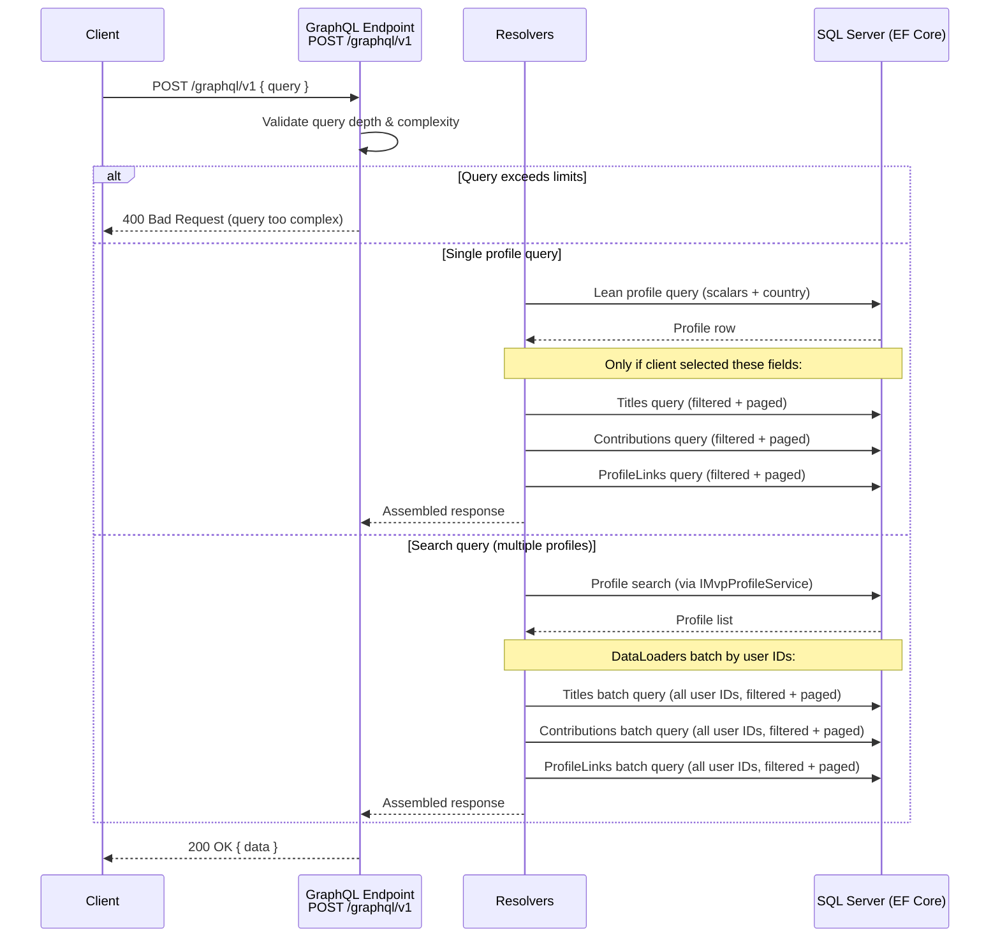

# GraphQL Endpoint for MVP Profiles

## Problem / Opportunity

Community integrations (starting with a Bluesky MVP labeling project) need to query MVP profile data
from the Selections API. Today they must use REST endpoints that return fixed response shapes — consumers
can't select only the fields they need, and building filtered views requires multiple calls or
over-fetching.

A read-only GraphQL endpoint lets integrations self-serve queries, requesting exactly the data they need
in a single call.

## Proposed Solution

Add a new, read-only GraphQL endpoint at `/graphql/v1` to the existing Azure Functions API
using **HotChocolate** (already used within Sitecore). It exposes the same public `MvpProfile` data
already available through the REST `/v1/mvpprofiles` endpoints — no new data, no authentication.

The endpoint only accepts `POST` requests. `GET` requests are rejected.

### Data Fetching Strategy

Rather than eagerly loading all related data in-memory (as the REST endpoint's
`GetForMvpProfileReadOnlyAsync` does), the GraphQL endpoint optimizes data access:

- **Root profile** loads only scalar fields + country (lean query)
- **Nested collections** (`titles`, `publicContributions`, `profileLinks`) are resolved via
  **separate EF Core queries** with filtering and pagination pushed to the database
- **DataLoaders** batch collection queries when resolving multiple profiles in a search
  result, preventing N+1 query problems



### GraphQL Schema

```graphql
type Query {
    mvpProfile(id: ID!): MvpProfile
    mvpProfiles(
        text: String
        mvpTypeIds: [Int!]
        years: [Int!]
        countryIds: [Int!]
        mentor: Boolean
        openToMentees: Boolean
        page: Int = 1
        pageSize: Int = 100
    ): MvpProfileSearchResult!
}

type MvpProfileSearchResult {
    results: [MvpProfile!]!
    totalResults: Int!
    page: Int!
    pageSize: Int!
    facets: [SearchFacet!]!
}

type MvpProfile {
    id: ID!
    name: String
    imageUri: String
    country: Country
    titles(
        mvpTypeIds: [Int!]
        years: [Int!]
        page: Int = 1
        pageSize: Int = 100
    ): PaginatedTitles!
    publicContributions(
        types: [ContributionType!]
        fromDate: DateTime
        toDate: DateTime
        productIds: [Int!]
        page: Int = 1
        pageSize: Int = 100
    ): PaginatedContributions!
    profileLinks(
        types: [ProfileLinkType!]
        page: Int = 1
        pageSize: Int = 100
    ): PaginatedProfileLinks!
    isMentor: Boolean!
    isOpenToNewMentees: Boolean!
    mentorDescription: String
}

type PaginatedTitles {
    items: [Title!]!
    totalCount: Int!
    page: Int!
    pageSize: Int!
}

type PaginatedContributions {
    items: [Contribution!]!
    totalCount: Int!
    page: Int!
    pageSize: Int!
}

type PaginatedProfileLinks {
    items: [ProfileLink!]!
    totalCount: Int!
    page: Int!
    pageSize: Int!
}

type Country {
    id: Int!
    name: String!
}

type Title {
    id: ID!
    mvpType: MvpType!
    application: TitleApplication!
}

type TitleApplication {
    id: ID!
    selection: TitleSelection!
}

type TitleSelection {
    id: ID!
    year: Int!
    finalized: Boolean!
}

type MvpType {
    id: Int!
    name: String!
}

type Contribution {
    id: ID!
    name: String!
    description: String!
    uri: String
    date: DateTime!
    type: ContributionType!
    relatedProducts: [Product!]!
}

type Product {
    id: Int!
    name: String!
}

type ProfileLink {
    id: ID!
    name: String!
    uri: String!
    imageUri: String
    type: ProfileLinkType!
}

type SearchFacet {
    identifier: String!
    options: [SearchFacetOption!]!
}

type SearchFacetOption {
    identifier: String!
    display: String!
    count: Int!
}

enum ContributionType {
    BLOG_POST
    SPEAKING
    CODE
    VIDEO
    SOCIAL_MEDIA
    BUG_REPORT
    FEEDBACK
    REFERENCE
    COMMUNITY
    MENTOR
    OTHER
}

enum ProfileLinkType {
    OTHER
    BLOG
    STACK_EXCHANGE
    COMMUNITY
    TWITTER
    YOUTUBE
    GITHUB
    LINKED_IN
    SLACK
    BLUESKY
}
```

**Note:** The schema deliberately mirrors the data the `MvpProfileContractResolver` already exposes
for anonymous users. Sensitive fields (email, roles, applications, reviews, title warnings, etc.)
are **not** in the schema.

### Collection Filtering & Pagination

All three nested collections support **database-level** filtering and offset-based pagination.
Filters and pagination are pushed into EF Core queries — data is never loaded fully into memory and
then filtered.

| Collection | Filter Arguments | Paging | DB Behavior |
|---|---|---|---|
| `titles` | `mvpTypeIds: [Int!]`, `years: [Int!]` | `page`, `pageSize` | `WHERE` + `SKIP`/`TAKE` on `Titles` table, scoped to user |
| `publicContributions` | `types: [ContributionType!]`, `fromDate: DateTime`, `toDate: DateTime`, `productIds: [Int!]` | `page`, `pageSize` | `WHERE` + `SKIP`/`TAKE` on `Contributions` table, scoped to user, `IsPublic = true` always enforced |
| `profileLinks` | `types: [ProfileLinkType!]` | `page`, `pageSize` | `WHERE` + `SKIP`/`TAKE` on `ProfileLinks` table, scoped to user |

- All filter arguments are optional. When omitted, no filter is applied.
- When multiple filters are provided on the same collection, they are combined with AND logic.
- `publicContributions` always enforces `IsPublic = true` — this is not optional.
- Each collection always enforces `onlyFinalized = true` for titles (finalized selections only).

### Data Access — New Repository Methods

The existing repositories need new methods to support the GraphQL resolvers. These follow the
established patterns (`GetAllReadOnlyAsync`, `AsNoTracking`, `Includes`, `Skip`/`Take`):

**`ITitleRepository`** — new method:
```
GetForUserReadOnlyAsync(Guid userId, IList<short>? mvpTypeIds, IList<short>? years,
    int page, short pageSize, includes) → (IList<Title>, int totalCount)
```
Filters: `Application.Applicant.Id == userId`, `Selection.Finalized == true`, plus optional
mvpTypeIds and years. Returns items + total count for pagination metadata.

**`IContributionRepository`** — new method:
```
GetPublicForUserReadOnlyAsync(Guid userId, IList<ContributionType>? types,
    DateTime? fromDate, DateTime? toDate, IList<int>? productIds,
    int page, short pageSize, includes) → (IList<Contribution>, int totalCount)
```
Filters: `Application.Applicant.Id == userId`, `IsPublic == true`, plus optional type/date/product filters.

**`IProfileLinkRepository`** — new method:
```
GetForUserReadOnlyAsync(Guid userId, IList<ProfileLinkType>? types,
    int page, short pageSize) → (IList<ProfileLink>, int totalCount)
```
Filters: `User.Id == userId`, plus optional type filter.

**`IUserRepository`** — new method:
```
GetLeanForMvpProfileReadOnlyAsync(Guid id) → User?
```
Loads only scalar user fields + Country (no `Include` for Applications, Links, or Contributions).
Used by the root `mvpProfile` query — the collections are resolved separately.

### DataLoaders (N+1 Prevention)

When the `mvpProfiles` search query returns multiple profiles, each needing nested collection
resolution, HotChocolate DataLoaders batch the requests:

- **`TitlesByUserIdDataLoader`** — batches title queries for multiple user IDs into a single
  `WHERE Application.Applicant.Id IN (...)` query
- **`ContributionsByUserIdDataLoader`** — same pattern for public contributions
- **`ProfileLinksByUserIdDataLoader`** — same pattern for profile links

DataLoaders receive the filter/paging arguments from the resolver context and apply them
to the batched query.

## Requirements

- [ ] New Azure Function endpoint at route `graphql/v1` accepting only `POST` with `AuthorizationLevel.Function`
- [ ] `GET` requests to `/graphql/v1` are rejected (return 405 Method Not Allowed)
- [ ] Implemented using **HotChocolate** for Azure Functions (isolated worker)
- [ ] Read-only: only `Query` root type, no mutations or subscriptions
- [ ] Introspection enabled (so consumers can discover the schema)
- [ ] Root profile query loads lean user data (scalars + country only) via new `GetLeanForMvpProfileReadOnlyAsync`
- [ ] Nested collections (`titles`, `publicContributions`, `profileLinks`) resolved via separate EF Core queries with DB-level filtering and pagination
- [ ] Search query reuses existing `IMvpProfileService.SearchMvpProfileAsync` for the profile list and facets
- [ ] DataLoaders for batching collection queries when resolving search results (N+1 prevention)
- [ ] New repository methods for each collection as specified above
- [ ] Offset-based pagination on all levels: `mvpProfiles` (top-level) and all three nested collections
- [ ] Facets (type, year, country, mentor) included in search results, matching REST behavior
- [ ] New `GraphQlOptions` configuration class following the existing options pattern:

```csharp
public class GraphQlOptions
{
    public const string GraphQl = "GraphQl";

    public int MaxQueryDepth { get; set; } = 5;

    public int MaxPageSize { get; set; } = 100;

    public int DefaultPageSize { get; set; } = 100;

    public CorsOptions Cors { get; set; } = new();

    public class CorsOptions
    {
        public string[] AllowedOrigins { get; set; } = ["*"];
    }
}
```

- [ ] Query depth validated against `MaxQueryDepth`; requests exceeding the limit return an error
- [ ] `pageSize` parameter clamped to `MaxPageSize` at all pagination levels (top-level and nested collections)
- [ ] CORS open for all origins by default, configurable via `GraphQlOptions.Cors.AllowedOrigins`
- [ ] `GraphQlOptions` bound from configuration section `"GraphQl"` and registered via DI (same pattern as `CacheOptions`, `MvpSelectionsOptions`, etc.)

## Edge Cases

| Scenario | Expected Behavior |
|----------|------------------|
| Query for non-existent MVP profile ID | Returns `null` for `mvpProfile` (not an error) |
| Query for user with no finalized titles | Returns `null` (same as REST — not an MVP profile) |
| `pageSize` exceeds `MaxPageSize` (any level) | Clamp to `MaxPageSize`, do not error |
| `page` < 1 or negative (any level) | Default to page 1 |
| Query depth exceeds `MaxQueryDepth` | Return GraphQL error response (400) before execution |
| Empty search (no filters) | Returns all MVP profiles, paginated (same as REST) |
| Malformed GraphQL query | Return standard GraphQL error response |
| Mutations attempted | Return error — schema has no mutations |
| `GET` request to `/graphql/v1` | Return 405 Method Not Allowed |
| Collection filter with empty array (e.g. `types: []`) | Treat as "no filter" — return all items |
| `fromDate` after `toDate` on contributions | Return empty collection (`totalCount: 0`) |
| Collection filter arguments all omitted | Return the full unfiltered collection, paged |
| Client doesn't select a nested collection field | Resolver is not invoked, no DB query is made (HotChocolate optimization) |
| Search returns 50 profiles, each needs titles | DataLoader batches into single `WHERE IN (...)` query, not 50 queries |

## Out of Scope

- Authentication / authorized data (admin-only fields, user-specific queries)
- Mutations (write operations)
- Subscriptions (real-time updates)
- Cursor-based pagination (may be added later)
- Rate limiting at the infrastructure level (Azure APIM / WAF) — this spec covers application-level query limits only
- Exposing entities beyond MvpProfile (e.g., direct Selection, Application, or User queries)
- Client library changes (`Mvp.Selections.Client`)
- GraphQL playground / Banana Cake Pop UI (developer can optionally add for dev environments)
- Changes to existing REST endpoints or their data loading patterns

## Open Questions

- [ ] **CORS in production:** Open CORS is fine for now. Should we restrict origins before going to production, or rely on API gateway/WAF for that?
- [ ] **DataLoader + per-profile filter/paging args:** When a search returns many profiles, each profile's collections may have different filter args in theory (GraphQL allows this). In practice the first consumer likely uses the same filters for all. The DataLoader needs to handle the case where filter args differ per-profile in the batch — the simplest approach is to group by filter args and execute one batch query per unique filter set. Alternatively, we could make the collection filters top-level on `mvpProfiles` to avoid this — worth discussing during implementation.

## Notes

- **Library choice:** HotChocolate is already used within Sitecore and has first-class Azure Functions isolated worker support via `HotChocolate.AzureFunctions.IsolatedProcess`.
- The first consumer is a community-driven Bluesky labeling project that needs to match MVPs to their Bluesky handles via `ProfileLink` data (note: `ProfileLinkType.Bluesky` already exists in the domain). The `profileLinks(types: [BLUESKY])` filter makes this a single targeted query.
- **DB optimization rationale:** The current REST endpoint's `GetForMvpProfileReadOnlyAsync` eagerly `Include`s all Applications, Titles, Contributions, Links, Products, Selections, and Countries in one query. This works for the REST response (which always returns everything) but would be wasteful for GraphQL where a client might only request `name` and `profileLinks`. Separate resolvers mean we only hit the DB for what the client actually asks for.
- **New repository methods follow existing patterns:** `ContributionRepository.GetAllQuery` already builds filtered, paged `IQueryable` chains. The new methods extend this approach with additional filters (contribution types, date range, product IDs) and return total counts for pagination.
- `ProfileLinkRepository` is currently bare (just inherits `BaseRepository`). It needs its first custom query method for the user-scoped, type-filtered, paged lookup.
- The search query still leverages the existing `IMvpProfileService.SearchMvpProfileAsync` for the profile list + facets + caching. The optimization applies to the nested collection resolution.
- Collection resolvers always enforce security constraints: `IsPublic = true` for contributions, `Selection.Finalized = true` for titles. These are hardcoded, not configurable.
- We chose to reject `GET` to keep a single, predictable entry point and avoid caching/logging complexity with query strings containing GraphQL queries.
